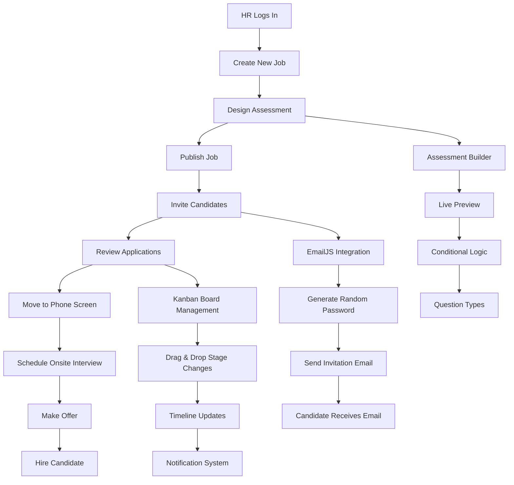
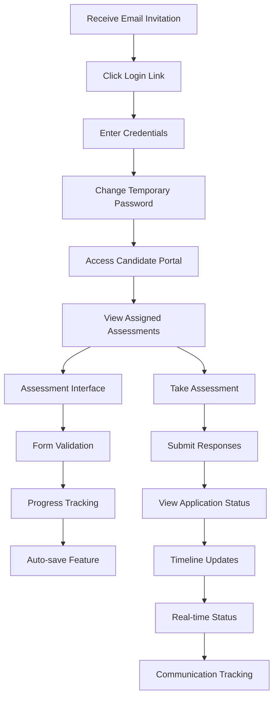
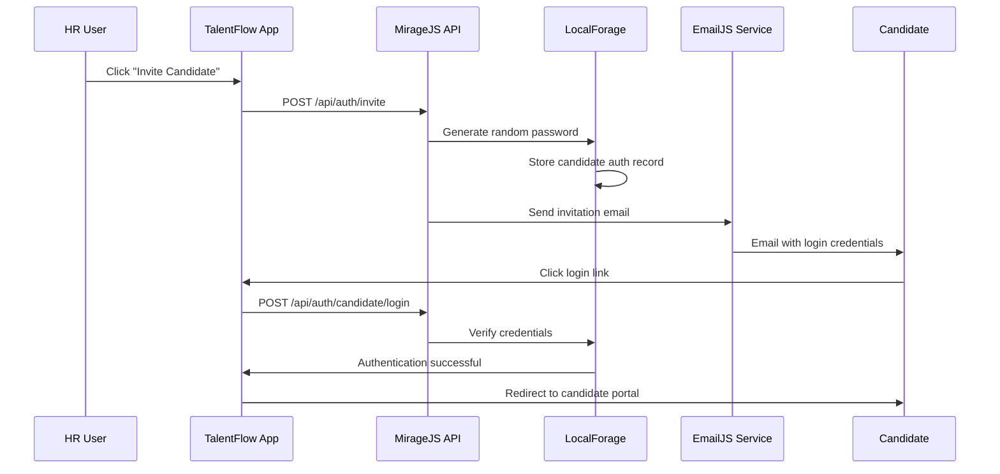
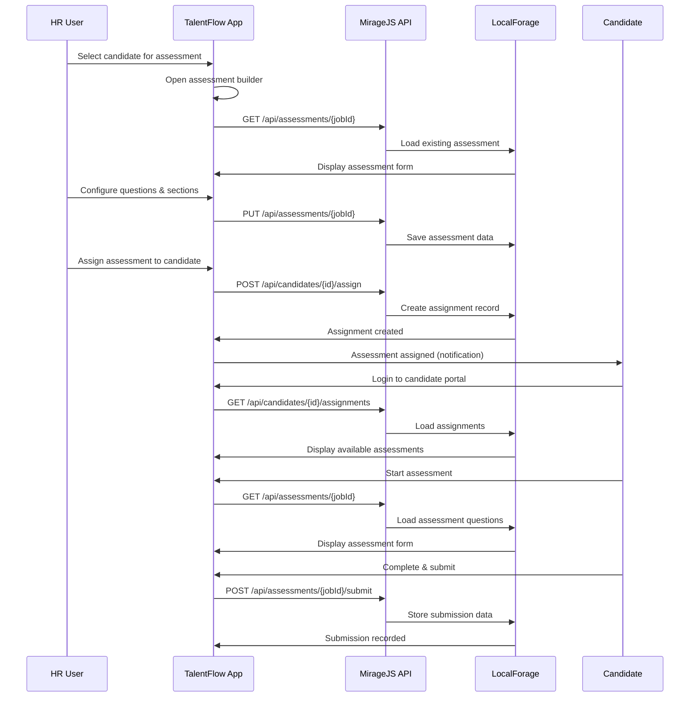
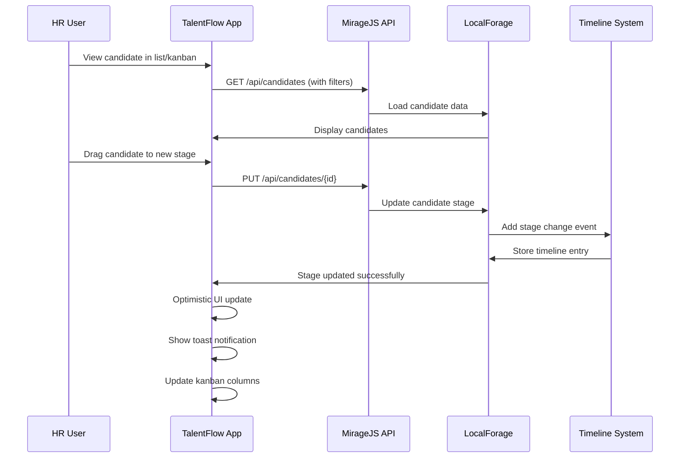

# TalentFlow — Mini Hiring Platform

A comprehensive React-based hiring platform with job management, candidate tracking, assessment building, and Kanban board functionality. Built with modern web technologies and runs entirely in the browser with no backend required.

## 🚀 Quick Start

```bash
# 1. Navigate to frontend directory
cd frontend

# 2. Install dependencies  
npm install

# 3. Start development server
npm run dev

# 4. Open browser to http://localhost:5173
```

## 📋 Table of Contents

- [Architecture](#-architecture)
- [Features](#-features)
- [Folder Structure](#-folder-structure)
- [Environment Setup](#-environment-setup)
- [API Endpoints](#-api-endpoints)
- [Components Guide](#-components-guide)
- [Technical Decisions](#-technical-decisions)
- [Known Issues](#-known-issues)
- [Development Guide](#-development-guide)

## 🏗️ Architecture

### Tech Stack
- **Frontend**: React 18 with Vite build system
- **Routing**: React Router DOM v6
- **Mock API**: MirageJS with artificial latency and error simulation
- **Persistence**: LocalForage (IndexedDB) for browser-based storage
- **Drag & Drop**: @dnd-kit for Kanban board functionality
- **Virtualization**: react-window for handling 1000+ candidates
- **Email**: EmailJS for candidate invitation emails
- **Styling**: Pure CSS with CSS custom properties (no framework)

### Data Flow
```
User Interaction → React Components → API Calls → MirageJS Server → LocalForage Storage → IndexedDB
```

### Key Design Patterns
- **Component-based architecture** with clear separation of concerns
- **Optimistic updates** with rollback on API failures
- **State management** via React hooks and local component state
- **Error boundaries** and graceful error handling
- **Responsive design** with mobile-first approach

## ✨ Features

### 🏢 Job Management
- **CRUD Operations**: Create, read, update, delete jobs
- **Advanced Filtering**: Search by title, company, location, type
- **Status Management**: Active, filled, archived states
- **Bulk Operations**: Archive/unarchive multiple jobs
- **Drag & Drop Reordering**: Visual job priority management
- **Pagination**: Handle large job lists efficiently

### 👥 Candidate Management  
- **Candidate Profiles**: Comprehensive candidate information
- **Stage Pipeline**: Applied → Phone Screen → Onsite → Offer → Hired/Rejected
- **Kanban Board**: Visual drag-and-drop stage management
- **Bulk Operations**: Move multiple candidates between stages
- **Timeline Tracking**: Complete audit trail of candidate interactions
- **Virtualized Lists**: Handle 1000+ candidates with smooth scrolling
- **Notes System**: Add notes with @mentions for team collaboration

### 📝 Assessment System
- **Assessment Builder**: Visual form builder with live preview
- **Question Types**: Single choice, multiple choice, text, numeric, file upload
- **Conditional Logic**: Show/hide questions based on previous answers
- **Section Organization**: Group questions into logical sections
- **Assessment Assignment**: Link assessments to specific jobs and candidates
- **Submission Tracking**: View and analyze candidate responses

### 🔐 Authentication & Access

### Default Credentials

**HR Portal Access:**
- **Email**: Any email (e.g., `hr@company.com`)
- **Password**: `password`
- **Access**: Full administrative access to all features

**Candidate Portal Access:**
- Candidates receive login credentials via email invitation
- Temporary password is generated automatically
- First login requires password change

## 📊 Workflow Diagrams

### Complete User Journey

#### **HR Workflow - Job Creation to Hiring**



#### **Candidate Experience Flow**



### Detailed Operation Flows

#### **Email Invitation Process**



#### **Assessment Assignment Workflow**



#### **Candidate Stage Management**



### User Personas & Use Cases

#### **HR Team Member Workflow**

1. **Day 1: Setup**
   - Login with default credentials
   - Create first job posting
   - Design assessment form
   - Set up candidate pipeline stages

2. **Weekly Operations**
   - Review incoming applications
   - Move candidates through pipeline
   - Schedule interviews
   - Send follow-up communications
   - Track hiring metrics

3. **Assessment Management**
   - Build role-specific assessments
   - Assign to qualified candidates
   - Review completed submissions
   - Make hiring decisions

#### **Candidate Experience**

1. **Application Process**
   - Receive email invitation
   - Create account with temp password
   - Complete assigned assessments
   - Track application progress

2. **Ongoing Communication**
   - Receive status updates
   - Get notified of next steps
   - Access assessment results
   - Communicate with HR team

#### **Technical Administrator**

1. **System Management**
   - Monitor system performance
   - Manage user permissions
   - Configure integrations (EmailJS)
   - Backup and maintain data

2. **Feature Enhancement**
   - Add new question types
   - Customize assessment templates
   - Integrate with external systems
   - Optimize performance for scale

### Integration Points

#### **External Services**
- **EmailJS**: Candidate invitation delivery
- **Browser APIs**: IndexedDB for data persistence
- **File System**: Assessment file uploads (simulated)

#### **Data Flow Architecture**
```
External Email → EmailJS → Application → MirageJS API → LocalForage → IndexedDB
```

#### **State Management**
- **Component State**: Local UI state management
- **Application State**: React Context for global settings
- **Persistent State**: IndexedDB for data durability
- **Session State**: localStorage for authentication

### 🎨 User Experience
- **Responsive Design**: Mobile-friendly layout with adaptive containers
- **Dark/Light Theme**: Toggle between visual themes
- **Loading States**: Visual feedback during API operations
- **Error Handling**: Graceful degradation with user-friendly messages
- **Keyboard Navigation**: Full accessibility support

## 📁 Folder Structure

```
frontend/
├── public/                     # Static assets
├── src/
│   ├── components/            # React components (organized by feature)
│   │   ├── assessment/       # Assessment builder and runner
│   │   │   ├── AssessmentBuilder.jsx
│   │   │   └── AssessmentRunner.jsx
│   │   ├── auth/            # Authentication components
│   │   │   ├── CandidateLogin.jsx
│   │   │   └── HRLogin.jsx
│   │   ├── candidate/       # Candidate management
│   │   │   ├── CandidateDetail.jsx
│   │   │   ├── CandidateForm.jsx
│   │   │   ├── CandidateList.jsx
│   │   │   ├── CandidatePortal.jsx
│   │   │   ├── CandidateProfile.jsx
│   │   │   ├── KanbanBoard.jsx
│   │   │   └── VirtualizedCandidateList.jsx
│   │   ├── common/          # Shared/reusable components
│   │   │   ├── ConfirmDialog.jsx
│   │   │   ├── Landing.jsx
│   │   │   └── Toast.jsx
│   │   └── jobs/           # Job management
│   │       ├── ArchivedList.jsx
│   │       ├── JobDetail.jsx
│   │       ├── JobForm.jsx
│   │       ├── JobList.jsx
│   │       ├── JobModal.jsx
│   │       └── JobsPage.jsx
│   ├── lib/                # Utilities and business logic
│   │   ├── email.js        # EmailJS integration
│   │   └── storage.js      # LocalForage data layer
│   ├── mirage/            # API mocking
│   │   └── server.js      # MirageJS server configuration
│   ├── App.jsx           # Main application component
│   ├── index.css        # Global styles and CSS variables
│   └── main.jsx        # Application entry point
├── package.json        # Dependencies and scripts
└── README.md          # This file
```

## 🔧 Environment Setup

### Required Environment Variables

Create a `.env` file in the frontend directory:

```env
# EmailJS Configuration (Optional - for sending candidate invitations)
VITE_SERVICE_ID=your_emailjs_service_id
VITE_TEMPLATE_ID=your_emailjs_template_id  
VITE_PUBLIC_KEY=your_emailjs_public_key
```

### EmailJS Setup (Optional)

1. **Create EmailJS Account**: Sign up at [emailjs.com](https://www.emailjs.com/)

2. **Create Email Service**: 
   - Add your email provider (Gmail, Outlook, etc.)
   - Note the Service ID

3. **Create Email Template**:
   - Template should include variables: `{{to_email}}`, `{{to_name}}`, `{{temp_password}}`
   - Example template:
   ```
   Hi {{to_name}},
   
   You've been invited to complete an assessment for TalentFlow.
   
   Login at: [Your App URL]
   Email: {{to_email}}
   Temporary Password: {{temp_password}}
   
   Best regards,
   TalentFlow HR Team
   ```

4. **Get Public Key**: Find in EmailJS dashboard under API Keys

5. **Add to Environment**: Update `.env` file with your credentials

### Development Environment

- **Node.js**: Version 16+ recommended
- **npm**: Comes with Node.js
- **Modern Browser**: Chrome, Firefox, Safari, Edge (last 2 versions)
- **Development Tools**: React DevTools extension recommended

## 🌐 API Endpoints

The application uses MirageJS to simulate a REST API. All data is persisted to browser IndexedDB.

### Jobs API

```javascript
GET    /api/jobs                    # List jobs with pagination and filters
POST   /api/jobs                    # Create new job
GET    /api/jobs/:id               # Get single job  
PUT    /api/jobs/:id               # Update job
DELETE /api/jobs/:id               # Delete job
POST   /api/jobs/reorder          # Reorder jobs
POST   /api/jobs/bulk-unarchive   # Unarchive multiple jobs
```

**Query Parameters for GET /api/jobs:**
- `search`: Filter by title, slug, or company
- `status`: Filter by status (`active`, `archived`, `filled`)
- `type`: Filter by job type (`Full-time`, `Part-time`, `Contract`)
- `page`: Page number (default: 1)
- `pageSize`: Items per page (default: 25)

### Candidates API

```javascript
GET    /api/candidates              # List candidates with filters
POST   /api/candidates              # Create new candidate
GET    /api/candidates/:id          # Get single candidate
PUT    /api/candidates/:id          # Update candidate  
DELETE /api/candidates/:id          # Delete candidate
GET    /api/candidates/:id/timeline # Get candidate timeline
POST   /api/candidates/:id/assign   # Assign assessment
GET    /api/candidates/:id/assignments # Get assignments
POST   /api/candidates/bulk-stage   # Bulk stage updates
```

**Query Parameters for GET /api/candidates:**
- `search`: Filter by name or email
- `stage`: Filter by pipeline stage
- `page`: Page number (default: 1)
- `pageSize`: Items per page (default: 1000)

### Assessments API

```javascript
GET    /api/assessments/:jobId            # Get assessment for job
PUT    /api/assessments/:jobId            # Save/update assessment
GET    /api/assessments/:jobId/submissions # Get submissions
POST   /api/assessments/:jobId/submit     # Submit assessment response
```

### Authentication API

```javascript
POST   /api/auth/hr/login          # HR login
POST   /api/auth/candidate/login   # Candidate login  
POST   /api/auth/invite           # Create candidate invitation
```

## 🧩 Components Guide

### Core Application Components

#### **App.jsx**
- Main application router and state management
- Handles theme switching and global state
- Manages authentication guards and routing

#### **Landing.jsx** 
- Home page with role selection (HR vs Candidate)
- Entry point for user journey

### Job Management Components

#### **JobsPage.jsx**
- Main jobs dashboard with filtering and pagination
- Handles job CRUD operations
- Integrates with JobList, JobModal components

#### **JobList.jsx**
- Displays job list with drag-and-drop reordering
- Inline editing capabilities
- Archive/unarchive functionality

#### **JobModal.jsx** 
- Job creation and editing form
- Automatic slug generation
- Form validation and error handling

#### **ArchivedList.jsx**
- Dedicated view for archived jobs
- Bulk unarchive operations
- Confirmation dialogs

### Candidate Management Components

#### **CandidateList.jsx**
- Standard candidate list view
- Individual candidate editing
- Stage transition controls

#### **VirtualizedCandidateList.jsx**
- High-performance list for 1000+ candidates
- Uses react-window for smooth scrolling
- Maintains all standard functionality

#### **KanbanBoard.jsx**
- Visual drag-and-drop stage management
- Real-time stage updates
- Responsive column layout
- Uses @dnd-kit for smooth interactions

#### **CandidateProfile.jsx**
- Comprehensive candidate detail view
- Timeline visualization
- Assessment assignment and tracking
- Notes with @mentions system

#### **CandidatePortal.jsx**
- Candidate-facing dashboard
- Assessment list and status
- Submission history

### Assessment Components

#### **AssessmentBuilder.jsx**
- Visual form builder with drag-and-drop
- Live preview panel
- Multiple question types support
- Conditional logic configuration

#### **AssessmentRunner.jsx**
- Candidate assessment taking interface
- Form validation and submission
- Progress tracking

### Authentication Components

#### **HRLogin.jsx / CandidateLogin.jsx**
- Role-specific login forms
- Session management
- Error handling

### Shared Components

#### **Toast.jsx**
- Global notification system
- Auto-dismiss functionality
- Multiple message types

#### **ConfirmDialog.jsx**
- Reusable confirmation modal
- Customizable title and message
- Promise-based interaction

## 🔧 Technical Decisions

### Why MirageJS?
- **No Backend Required**: Enables full frontend development without server setup
- **Realistic API Simulation**: Includes latency, error rates, and proper HTTP responses
- **Development Speed**: Rapid prototyping and feature development
- **Offline Capability**: Works without internet connection

### Why LocalForage?
- **Browser Persistence**: Data survives page reloads and browser restarts
- **IndexedDB Performance**: Fast storage for large datasets
- **Fallback Support**: Gracefully degrades to localStorage/WebSQL
- **Promise-based API**: Clean async/await patterns

### Why @dnd-kit?
- **Accessibility**: Built-in screen reader and keyboard support
- **Performance**: Smooth animations and interactions
- **Framework Agnostic**: Works well with React patterns
- **Customizable**: Flexible styling and behavior options

### Why react-window?
- **Performance**: Handles thousands of items without performance degradation
- **Memory Efficient**: Only renders visible items
- **Smooth Scrolling**: Native browser scrolling behavior
- **Responsive**: Adapts to container size changes

### CSS Architecture
- **CSS Custom Properties**: Dynamic theming support
- **No CSS Framework**: Reduces bundle size and maintains control
- **Mobile-First**: Responsive design from ground up
- **Component Scoping**: Styles organized by component

## 🐛 Known Issues

### Current Limitations

1. **Email Service Dependency**
   - Requires EmailJS configuration for candidate invitations
   - Fallback needed for offline development
   - **Workaround**: App functions without email, shows configuration prompts

2. **Browser Storage Limits** 
   - IndexedDB has browser-specific size limits
   - No automatic cleanup of old data
   - **Mitigation**: Monitor storage usage, implement cleanup utilities

3. **No Real-time Collaboration**
   - Multiple HR users can't collaborate simultaneously
   - No conflict resolution for concurrent edits
   - **Future Enhancement**: WebSocket integration needed

4. **Mobile Optimization**
   - Kanban board challenging on small screens
   - Complex forms may be difficult on mobile
   - **Current Solution**: Mobile blocker for screens < 768px

5. **Assessment Limitations**
   - No file upload storage (files are just names)
   - Limited question types compared to full form builders
   - No scoring or automated evaluation

### Performance Considerations

- **Large Datasets**: Virtualization helps but filtering still processes all records
- **Memory Usage**: Browser storage can grow large with extensive usage
- **Bundle Size**: Could be optimized with code splitting

### Security Notes

- **Client-side Only**: No server-side validation or security
- **Data Exposure**: All data visible in browser developer tools
- **Authentication**: Simple session management, not production-ready

## 🛠️ Development Guide

### Adding New Features

1. **Create Component**: Add to appropriate folder under `src/components/`
2. **Update Routes**: Modify `App.jsx` routing if needed
3. **Add API Endpoints**: Extend `src/mirage/server.js`
4. **Update Storage**: Modify `src/lib/storage.js` for data operations
5. **Test Integration**: Ensure all imports and dependencies work

### Code Style Guidelines

- Use **functional components** with hooks
- Implement **error boundaries** for robust error handling
- Follow **React best practices** (keys, props, state management)
- Use **semantic HTML** for accessibility
- Implement **responsive design** patterns

### Testing Strategy

- **Manual Testing**: Core user workflows
- **Cross-browser Testing**: Chrome, Firefox, Safari, Edge
- **Responsive Testing**: Mobile, tablet, desktop breakpoints
- **Performance Testing**: Large datasets, network throttling
- **Accessibility Testing**: Screen readers, keyboard navigation

### Building for Production

```bash
# Build optimized bundle
npm run build

# Preview production build locally  
npm run preview

# Deploy static files from dist/ directory
```

### Debugging Tips

1. **React DevTools**: Install browser extension for component inspection
2. **Network Tab**: Monitor API calls and responses in browser
3. **Application Tab**: Inspect IndexedDB data in browser tools
4. **Console Logs**: Check for API errors and state changes
5. **Responsive Mode**: Test different screen sizes in browser tools

### Contributing Guidelines

1. **Component Organization**: Follow existing folder structure
2. **Import Paths**: Use relative imports for components, absolute for utilities
3. **State Management**: Keep state as local as possible
4. **Error Handling**: Always handle API failures gracefully
5. **Performance**: Consider virtualization for large lists
6. **Accessibility**: Include proper ARIA labels and keyboard navigation

---

## 📞 Support

For questions, issues, or contributions:

1. **Check Known Issues**: Review limitations section above
2. **Browser Console**: Check for JavaScript errors
3. **Network Tab**: Verify API calls are working
4. **Clear Storage**: Reset IndexedDB if data seems corrupted
5. **Environment Variables**: Verify EmailJS configuration if using email features

**Development Notes**: This is a demo/prototype application intended for showcasing modern React development patterns. For production use, consider adding proper backend services, authentication, security measures, and comprehensive testing.
